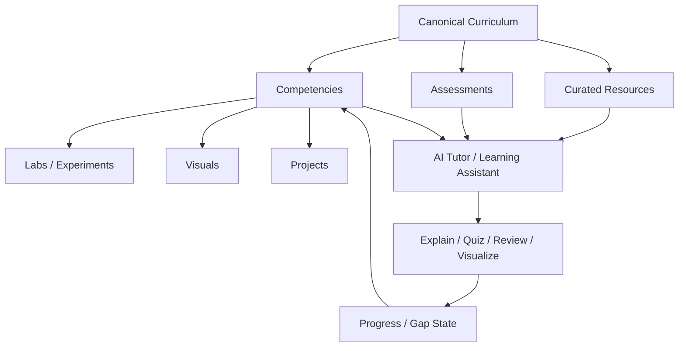

# AI Engineering Atlas

> An evidence-backed, executable, gap-driven curriculum for becoming a strong AI Engineer.

**AI Engineering Atlas** is **not** an awesome-list and **not** a linear course. It is a competency graph that combines:

- strong Software Engineering foundations,
- Systems and Data Engineering,
- ML / Deep Learning / LLM foundations,
- Applied AI Engineering,
- Evaluation and experimentation,
- Agents and orchestration,
- Production AI, security, governance, and multimodal systems.

The core rule is simple:

> **Diagnose → learn only the gap → practice → measure → explain → pass the exit test → move on.**

## Why this repo exists

Most AI roadmaps optimize for breadth or tool familiarity. This project instead treats AI Engineering as a layered engineering discipline and keeps the curriculum grounded in explicit competencies, curated sources, diagnostics, labs, and exit criteria.

The curriculum design borrows the strongest patterns from:

- **OSSU** — curriculum governance and versioning,
- **Microsoft learning repos** — self-contained lesson packaging,
- **Made With ML** — notebook → code → test → production discipline,
- **roadmap.sh** — visual competency maps and progress-oriented learning UX.

## How to use it

1. Open the [master roadmap](ROADMAP.md).
2. Run the diagnostic for a domain or competency.
3. If you already pass the exit criteria, **skip it**.
4. Otherwise use one primary source plus one visual source.
5. Complete the smallest useful lab or experiment.
6. Add the artifact and your findings.
7. Move on only when the exit criteria are satisfied.

See [LEARNING_METHOD.md](LEARNING_METHOD.md) for the full learning loop.

## Repository model

AI may help explain, quiz, review, visualize, or propose changes, but **AI-generated content is not curriculum truth**. Curriculum changes require evidence and review.

## Canonical sources

- `curriculum/` — competency graph and learning units
- `resources/` — curated external evidence / learning resources
- `schemas/` — machine-readable contracts
- `rfcs/` — proposed curriculum changes

`README.md` and generated docs are presentation layers, not the canonical curriculum.

## Competency package

Each important competency should answer:

- What must I know?
- Why does it matter?
- What are the prerequisites?
- How do I diagnose whether I already know it?
- What source should I learn from?
- What should I build or experiment with?
- What should I visualize?
- How do I prove competence?
- What does this unlock next?

Example: [`Self-Attention`](curriculum/06-llm-foundations/self-attention/README.md).

## Curriculum domains

| Domain | Purpose |
|---|---|
| Software Engineering | Programming, OS, networking, databases, testing, architecture |
| Systems | Distributed systems, reliability, cloud, observability |
| Data Engineering | Data pipelines, modeling, quality, lineage |
| ML Foundations | Math, statistics, classical ML |
| Deep Learning | Optimization, backprop, embeddings, representation learning |
| LLM Foundations | Tokenization, transformers, inference, context |
| AI Engineering | Model selection, context, retrieval, evals, adaptation |
| Agents | Tool use, state, memory, orchestration, MCP |
| Production AI | Gateways, tracing, releases, latency, cost |
| Security & Governance | Prompt injection, permissions, privacy, supply-chain risk |
| Multimodal | Vision, audio, voice, document AI |
| Specializations | LLM systems, post-training, reasoning, search, platform |

## Resource roles

Resources are tagged by purpose rather than dumped into a single list:

- `primary` — main source for learning a competency
- `visual` — intuition / interactive explanation
- `practice` — exercises, notebooks, assignments
- `reference` — deeper or supplementary material

## Governance

Curriculum and resource changes are versioned differently:

- **MAJOR** — changes the competency graph or required outcomes
- **MINOR** — changes recommended resources or practice while preserving competencies
- **PATCH** — metadata, wording, broken links, presentation fixes

Substantial curriculum changes should start as an RFC. See [`rfcs/0000-template.md`](rfcs/0000-template.md).

## Status

This repository is intentionally seeded with the structure and a few example competencies first. Resources, labs, assessments, visualizations, and projects can be added progressively without changing the overall information architecture.

## License

MIT. See [LICENSE](LICENSE).
