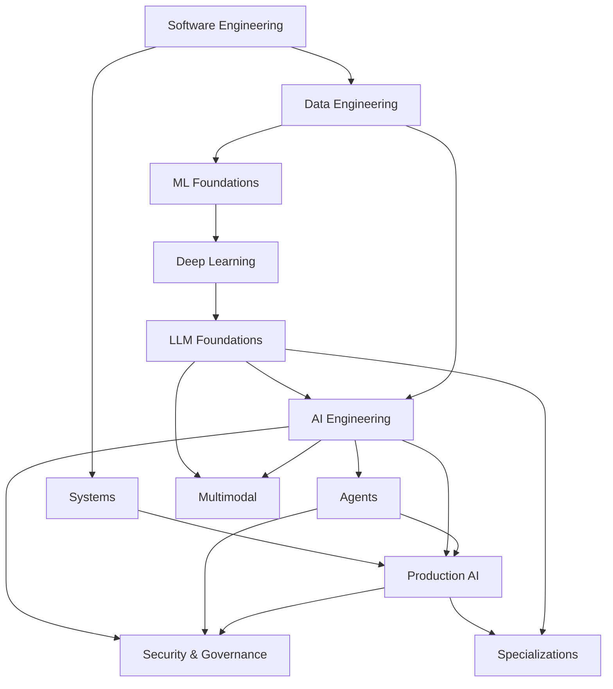

# Roadmap

This page is the coverage map for AI Engineering Atlas.

It answers **what belongs in the curriculum**. It does not imply that every item already has a complete learning route.

For the learner workflow, start at [START_HERE.md](START_HERE.md).

## Status model

| Status | Meaning |
| --- | --- |
| Coverage | The topic is included in the audited scope and has a place in the competency graph |
| Ready route | Diagnostic, precise sources, practice, exit evidence, transfer/review where needed |
| Project integration | The capability has a defined place in a reference project |

The repository currently has broad **coverage** and is progressively converting high-value topics into **ready routes**.

## Dependency map

This is a dependency guide, not a mandatory sequence. Use the baseline scan and prerequisites to skip what you can already demonstrate.

---

# 1. Software Engineering

Coverage:

- programming fundamentals;
- Python for AI engineering;
- data structures and algorithms;
- object-oriented and functional design;
- testing and quality engineering;
- software architecture and maintainability;
- requirements, delivery, Git, Linux, and engineering process.

Default target: **L2**, with L3 in areas central to the learner's work.

---

# 2. Systems

Coverage:

- operating systems, processes, threads, concurrency;
- networking;
- databases and storage;
- distributed systems;
- API and service design;
- cloud and production infrastructure;
- observability;
- computer architecture;
- performance engineering.

Typical AI connection:

- concurrent model/tool calls;
- retries and idempotency;
- queues and backpressure;
- storage and retrieval systems;
- GPU/CPU/memory behavior;
- production debugging.

---

# 3. Data Engineering

Coverage:

- data modeling;
- batch and streaming pipelines;
- orchestration;
- data quality;
- lineage and provenance;
- versioning and reproducibility;
- storage formats and partitioning;
- ingestion, update, deletion, and freshness.

This domain supports training data, retrieval corpora, evaluation datasets, and feedback loops.

---

# 4. ML Foundations

Coverage:

- linear algebra;
- calculus;
- probability;
- statistics;
- discrete mathematics and CS reasoning;
- numerical computing and floating point;
- classical supervised and unsupervised ML;
- metrics;
- bias, variance, generalization;
- experimental design.

The target is enough depth to reason about model behavior and measurements rather than only call APIs.

---

# 5. Deep Learning

Coverage:

- neural networks and computation graphs;
- gradient descent and backpropagation;
- optimization;
- initialization, normalization, regularization;
- embeddings and representation learning;
- sequence modeling;
- training dynamics and diagnostics.

---

# 6. LLM Foundations

Coverage:

- tokenization;
- embeddings;
- transformer architecture;
- self-attention;
- positional information;
- language-model training;
- decoding and sampling;
- context windows;
- KV cache;
- quantization;
- inference behavior;
- open-source model basics and local serving.

Ready route:

- [Self-Attention](curriculum/06-llm-foundations/self-attention/)

Project integration:

- [Tiny Transformer](projects/tiny-transformer/)

---

# 7. AI Engineering

Coverage:

## Product and model decisions

- AI product and problem framing;
- deterministic/simple baselines;
- model landscape and selection;
- uncertainty, abstention, and trust;
- model/provider choices.

## Model interaction

- prompt engineering;
- context engineering;
- structured outputs;
- tool calling.

## Retrieval and RAG

- embeddings for retrieval;
- lexical, semantic, and hybrid search;
- vector-search internals;
- chunking;
- metadata filtering;
- reranking;
- query transformation;
- advanced RAG patterns;
- retrieval data lifecycle;
- RAG evaluation.

## Evaluation and experimentation

- evaluation datasets;
- deterministic evaluation;
- semantic evaluation;
- LLM-as-judge;
- human evaluation;
- pairwise evaluation;
- repeated-run evaluation;
- agent evaluation;
- production evaluation;
- evaluation reliability and statistical discipline;
- experimentation.

## Data and adaptation

- AI data engineering;
- dataset quality;
- annotation;
- synthetic data;
- feedback loops;
- fine-tuning;
- SFT;
- PEFT / LoRA;
- preference optimization;
- distillation;
- human feedback and product analytics.

Ready routes:

- [Model Selection](curriculum/07-ai-engineering/model-selection/)
- [AI Evaluation and Experimentation](curriculum/07-ai-engineering/evaluation/)

Project integration:

- [Knowledge Assistant](projects/knowledge-assistant/)

---

# 8. Agents

Coverage:

- agent fundamentals;
- deterministic versus agentic design;
- state;
- memory;
- planning;
- verification;
- multi-agent systems;
- long-running agents;
- MCP;
- workflow orchestration;
- agent evaluation and failure analysis.

Ready route:

- [Deterministic vs Agentic Design](curriculum/08-agents/deterministic-vs-agentic/)

The default rule is to begin with a deterministic workflow and add agentic control only when the flexibility is useful and measurable.

---

# 9. Production AI

Coverage:

- compound AI systems;
- model/provider gateway;
- routing and fallback;
- caching;
- streaming;
- cost engineering;
- latency engineering;
- AI observability and traces;
- request replay;
- release engineering;
- model/prompt/retrieval versioning;
- MLOps / LLMOps;
- drift;
- deployment and rollback;
- production feedback loops.

Project integration:

- later milestones of the [Knowledge Assistant](projects/knowledge-assistant/).

---

# 10. Security & Governance

Coverage:

- direct and indirect prompt injection;
- data exfiltration;
- tool permissions;
- sandboxing;
- authentication and authorization;
- multi-tenant isolation;
- guardrails;
- AI supply-chain and data-security risks;
- privacy and retention;
- governance;
- legal/licensing considerations;
- responsible AI;
- adversarial testing.

Ready route:

- [Prompt Injection and Trust Boundaries](curriculum/10-security-governance/prompt-injection/)

These topics extend normal application security; they do not replace it.

---

# 11. Multimodal

Coverage:

- multimodal model fundamentals;
- image and vision inputs;
- voice AI;
- streaming audio;
- document AI;
- OCR and layout-aware processing;
- multimodal embeddings and retrieval;
- human-AI interaction and UX considerations.

---

# 12. Optional Specializations

Coverage:

- LLM systems and inference optimization;
- post-training and reasoning;
- ML research;
- AI platform engineering;
- AI developer tools;
- search and retrieval systems.

These tracks are chosen from role/project needs rather than treated as universal requirements.

---

# Current curriculum maturity

The breadth above comes from the audited master roadmap and benchmark review. A topic becomes a **ready route** only after it satisfies the contract in [LEARNING_MODEL.md](LEARNING_MODEL.md):

1. curriculum evidence;
2. prerequisites;
3. observable outcomes;
4. diagnostic;
5. precise source route;
6. practice;
7. matching exit evidence;
8. transfer when relevant;
9. project integration when relevant;
10. delayed review when relevant.

Until then, it remains coverage, not finished instructional content.
